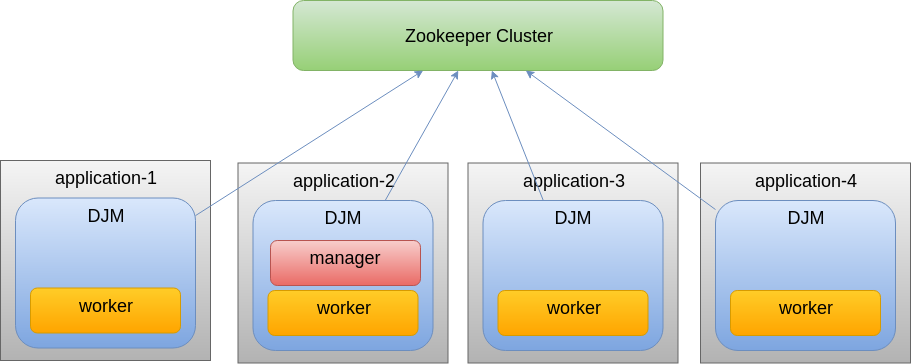
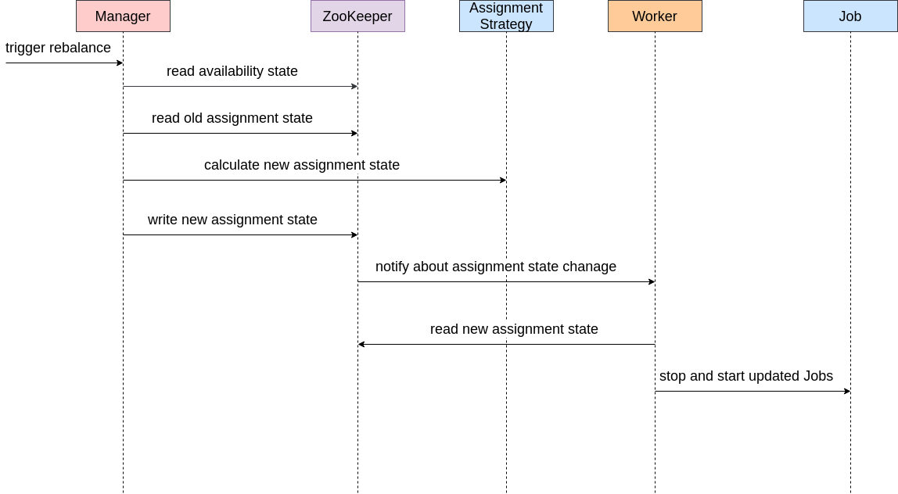
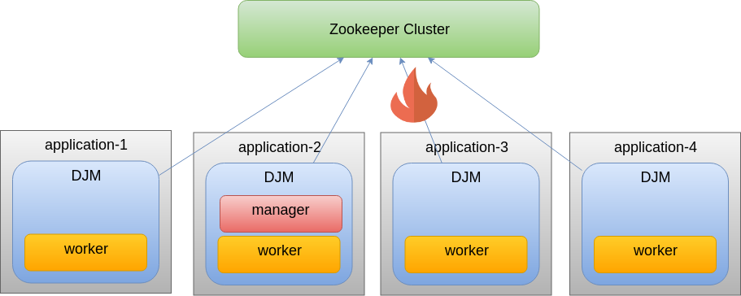

= Distributed Job Manager
:toc: left
:toclevels: 4
:source-highlighter: coderay

[abstract]
DistributedJobManager will schedule tasks and balance workload in the cluster.
[link=https://search.maven.org/search?q=g:ru.fix%20and%20a:distributed-job-manager]
image::https://img.shields.io/maven-central/v/ru.fix/distributed-job-manager.svg[]
image:https://github.githubassets.com/images/modules/logos_page/GitHub-Mark.png[32,32]
link:https://github.com/ru-fix/distributed-job-manager[]

== Concept

DistributedJobManager (DJM) stores it's state in link:https://zookeeper.apache.org/[ZooKeeper] +
DJM lives withing JVM application and maintain it's own thread pool. +
DJM regularly launches user defined jobs in separate threads based on schedule. +
User defined Job is any class that implements `DistributedJob` interface. +
DJM will restart Job in case of any failure. +
DJM balance workload between Jobs +
DJM consists of two parts: Manager and Worker. Each DJM instance has active Worker.
  But only one DJM instance has active Manager. +
Manager orchestrate Job between Workers in the cluster.



User defined Job should implement `DistributedJob` interface and provide information about work-items. +
Work-item is a smallest indivisible peace of work. +
Job WorkPool is a list of work-items that DJM will split between active Workers.
[code]
----
class MyJob implements DistributedJob{
    //...
    WorkPool getWorkPool(){
        return WorkPool.of(new HashSet<>(Arrays.asList("workItem1", "workItem2")));
    }
}
----

Job informs DJM about WorkPool. +
DJM split work-items from WorkPool among all Workers evenly. +
If Job define WorkPool with single work-item then it means that such a job will be launched by DJM
only within single application in the cluster.

When DJM launches Job it passes information about work-items that Job should process.
[code]
----
class MyJob implements DistributedJob{
    //...
void run(DistributedJobContext context) {
    //...
    Set<String> workShare = context.getWorkShare();
    for (String workItem : workShare) {
        //process workItem
    }
}
----

=== Assignment Strategies
Number of active worker changes over time due to server reboot or crash. Jobs change number
and composition of their work items. This events trigger DJM reassignment process.
During reassignment DJM Manager uses an Assignment Strategy to decide to which worker
particular work item will be assigned. +
DJM provides several implementations for the most common cases of work item distribution among workers.
You can implement custom AssigmentStrategy for your case and register it within DJM.

* EvenlySpreadAssignmentStrategy +
Intended for evenly distribution all available jobs on all available workers.
It's ignores previous assignment

* RendezvousHashAssignmentStrategy +
It minimize job reassignment within
living workers when new worker added or one of workers removed using Rendezvous hash

=== Example of bean configuration in Spring Framework
[code]
----

public static class RebillJob implements DistributedJob {
        public String getJobId() {
            return "rebill-job";
        }
        //...
    }

    public static class SmsJob implements DistributedJob {
        public String getJobId() {
            return "sms-job";
        }
        // ...
    }

    public static class UssdJob implements DistributedJob {
        @Override
        public String getJobId() {
            return "ussd-job";
        }
    }

    public class CustomAssignmentStrategy implements AssignmentStrategy {

        public AssignmentState reassignAndBalance(
                Map<JobId, AssignmentState> availability,
                AssignmentState prevAssignment,
                AssignmentState currentAssignment
        ) {

            AssignmentState newState = ussdAssignmentStrategy.reassignAndBalance(
                    Map.of(new JobId("ussd-job"), availability.get(new JobId("ussd-job"))),
                    prevAssignment,
                    currentAssignment
            );
            availability.remove(new JobId("ussd-job"));

            newState = smsAssignmentStrategy.reassignAndBalance(
                    Map.of(new JobId("sms-job"), availability.get(new JobId("sms-job"))),
                    prevAssignment,
                    newState
            );
            availability.remove(new JobId("sms-job"));

            // reassign items of other jobs using evenly spread strategy
            return AssignmentStrategies.EVENLY_SPREAD.reassignAndBalance(
                    availability,
                    prevAssignment,
                    newState
            );
        }
    }

@Bean
DistributedJobManager distributedJobManager() throws Exception {
    return new DistributedJobManager(
            "my-app-server-1", // application id
            CuratorFrameworkFactory.newClient(zkHosts, new ExponentialBackoffRetry(1000, 10)),
            "zk/root/path",
            Arrays.asList(
                    new SmsJob(),
                    new UssdJob(),
                    new RebillJob()
            ),
            new CustomAssignmentStrategy(),
            new AggregationProfiler(),
            DynamicProperty.of(180000), // Time to wait for tasks to be completed when the application is closed and when tasks are redistributed
            DynamicProperty.of(true) // Log full tree during job rebalancing operation
    );
}
----

image::djm.png[]


== Getting started

=== Add dependency into your project.

.Java dependencies
* distributed-job-manager image:https://img.shields.io/maven-central/v/ru.fix/distributed-job-manager.svg[link=https://search.maven.org/search?q=g:ru.fix%20and%20a:distributed-job-manager]

=== Launch DJM
DJM requires list of ZooKeeper hosts and path within ZooKeeper that will be used to store DJM state. +
DJM will use provided applicationId to identify application instance within cluster. +

[code]
----
//During application startup
DistributedJobManager djm = new DistributedJobManager(
    "zooKeeperHost1,zooKeeperHost2,zooKeeperHost3"
    "/zooKeeperPath/for/djm",
    "applicaiotId#3",
    Arrays.asList(new MyJob1(), new MyJob2()));

//During applicatoin shutdown
djm.close();
----

=== Monitoring and metrics
DJM expose Jobs state through profiler metrics. +
* What tasks are currently running.
* How long it took for task to complete.
* How many work items processed.
* etc.


== Reassignment
Reassignment is a process when Master change Job and work-items assigment between application instances in the cluster. +
Reassignment is triggered by

* One of nodes shutdown or restart
* Network disconnect
* Job WorkPool changes

Rebalance steps:



* Manager reads from zookeeper availabiliy state - list of jobs, where they can be launched and list of each job work-items
* Manager reads from zookeeper assignment state - on which nodes jobs and work-items are launched or scheduled right now.
* Manager calculate new assignment state
* Manager writes new assignment state to zookeeper
* Workers receive notification from zookeeper about assignment state update
* Workers stops old Jobs and launches new Jobs according to new assignment state.

Main goal of rebalance process is to minimize unnecessary job restarts and reassignments.

== State
DJM keeps cluster state as a tree of zookeeper nodes. +
Worker registers Jobs and update available subtree. +
Manager update assigned subtree. +
Worker listens for updates in assigned subtree and stop/launch jobs accordingly.


```
job-manager
  └ alive //alive workers that can run jobs
    └ 20 //worker with id 20
    └ 3  //worker with id 3
    ...
  └ locks //locks guard work-items: ony one Job can access work-item in the same time
    └ work-pooled
      └ async.report.building.job //job id
        └ workItemA.lock  //list of job locks so only one node could run job with same work-item
      └ elasticsearch.upload.job
        └ workItemC.lock
        ...
  └ assignment-version //part of transaction, allows atomicaly assign jobs
  └ registration-version //part of transaction, allows atomicaly register workier
  └ leader-latch // used for Manager election
    └ ...
  └ workers //list of workers
    └ 20
     ...
    └ 3
      └ available //list of jobs that worker with id `3` can run
        └ work-pooled
          └ async.report.building.job
            └ work-pool
              └ workItemA //Work pool of report.building Job
              └ workItemB
          └ elasticsearch.upload.job
            └ work-pool
              └ workItemC
           ...
      └ assigned
        └ work-pooled                   //List of assigned jobs to worker '3'
          └ async.report.building.job
            └ work-pool
              └ workItemA  //report.building job with `workItemA` and `workItemB` is assigned to worker `3`
              └ workItemB
          └ elasticsearch.upload.job
            └ work-pool
              └ workItemC
           ...
```

== Guarantees

In case of network failure one one can be temporary detached from other part of the cluster. +
In order to improve stability of the cluster and tolerate short connectivity problems
DJM allows detached Worker to continue it's work for configured amount of time. +
To enable that DJM uses persistent locks and keep information when which worker started to process particular job in ZooKeeper. +
Other Workers will not be able to process same work-items during this lock timeout even if owner of lock gone offline.




include::source-guidebook.adoc[]
